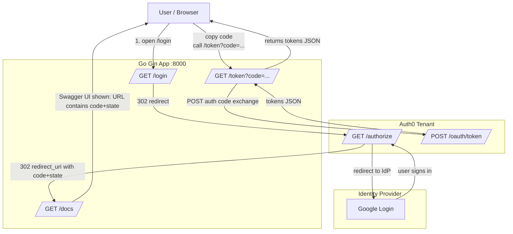

## Auth0 Configuration

### Sample `config.yaml`

```yaml
auth:
  domain: "dev-xxxx.us.auth0.com"               # Auth0 tenant domain (Applications -> Your Web App -> Domain)
  client_id: "YOUR_WEB_APP_CLIENT_ID"           # Applications -> Your Web App -> Client ID
  client_secret: "YOUR_WEB_APP_SECRET"          # Applications -> Your Web App -> Client Secret
  audience: "https://apithreats.com/api/orders" # APIs -> Your API -> Identifier (Audience)
  redirect_uri: "http://172.16.9.5:8000/docs"   # Must match Allowed Callback URL exactly
```

### Login and Token Validation (Auth0 Authorization Code Flow)

- This project demonstrates the Auth0 Authorization Code flow:

1. Hit `/login` to redirect to Auth0 Universal Login (Google/Gmail in this example).

2. After successful authentication, Auth0 redirects back to `/docs` with a `code` and `state`.

3. Copy the code and call `/token?code=...` to exchange it for tokens.

### Start Login

Open in browser:

```
http://172.16.9.5:8000/login
```
This redirects to Auth0 Universal Login.

### Auth0 Redirect Back (Capture `code`)

After login, Auth0 redirects back to a URL like:

```
http://172.16.9.5:8000/docs/?code=AmjXcvCt0lNioo2FD0nVx_PfhzI5Rx0_ndNjxmVHqe41Q&state=EIPe4GPAgTxz3Xs6nZMh9g#/default/token
```

### Extract the authorization code

From the above URL:

- `code` = `AmjXcvCt0lNioo2FD0nVx_PfhzI5Rx0_ndNjxmVHqe41Q`
- `state` = `EIPe4GPAgTxz3Xs6nZMh9g`

> Note: Everything after `#` is a browser-only fragment (Swagger UI routing) and is not sent to the server.

---

## 3) Exchange Code for Tokens

Call `/token` with the extracted `code`.

### Example (curl)

```bash
curl -X 'GET' \
  'http://172.16.9.5:8000/token?code=AmjXcvCt0lNioo2FD0nVx_PfhzI5Rx0_ndNjxmVHqe41Q' \
  -H 'accept: application/json'

* Sample output
{
  "data": {
    "access_token": "<ACCESS_TOKEN>",
    "expires_in": 86400,
    "id_token": "<ID_TOKEN>",
    "scope": "openid profile email",
    "token_type": "Bearer"
  }
}
```

### Flow Diagram


  #### Sequence Diagram
  ```mermaid
  sequenceDiagram
  %% GitHub-compatible Mermaid (sequence)
  autonumber
  actor User as User/Browser
  participant App as Go (Gin) App :8000
  participant Auth0 as Auth0 Tenant
  participant IdP as Google (IdP)

  User->>App: GET /login
  App-->>User: 302 Location: https://<tenant>.auth0.com/authorize?...&state=...

  User->>Auth0: GET /authorize (client_id, redirect_uri, audience, scope, state)
  Auth0-->>User: Redirect to IdP (if not already logged in)
  User->>IdP: Login (Google)
  IdP-->>Auth0: Authentication result
  Auth0-->>User: 302 redirect_uri -> http://172.16.9.5:8000/docs?code=...&state=...

  User->>App: GET /docs?code=...&state=...
  App-->>User: Swagger UI / docs page (code visible in URL)

  User->>App: GET /token?code=...
  App->>Auth0: POST /oauth/token (grant_type=authorization_code, code, redirect_uri, client_id, client_secret)
  Auth0-->>App: JSON {access_token, id_token, expires_in, token_type, scope}
  App-->>User: JSON tokens response
```

